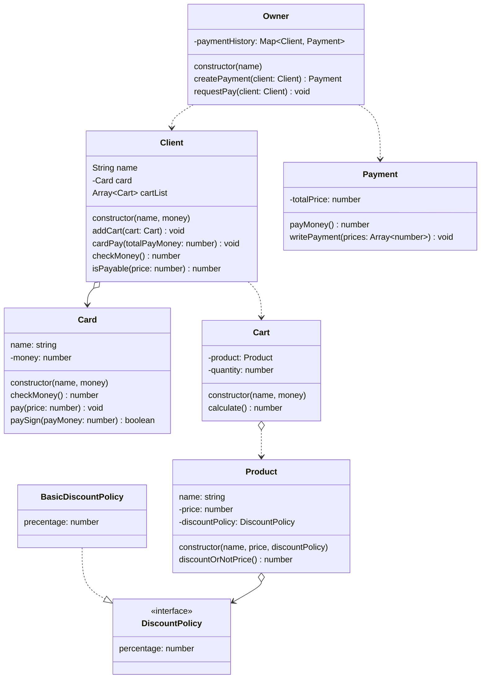
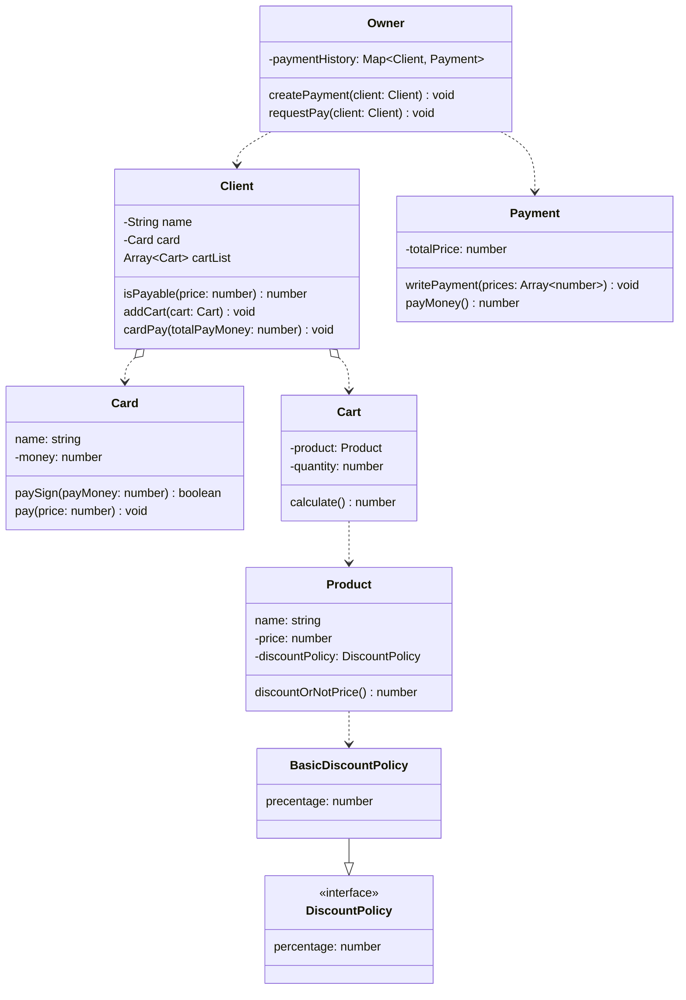

# 마트 결제 시스템 class diagram

## 변경 (테스트 케이스 추가)

```mermaid
classDiagram
  class Client {
    String name
    -Card card
    Array~Cart~ cartList
    constructor(name, money)
    addCart(cart: Cart) void
    cardPay(totalPayMoney: number) void
    checkMoney() number
    isPayable(price: number) number
  }

  class Owner {
    -paymentHistory: Map~Client, Payment~
    constructor(name)
    createPayment(client: Client) Payment
    requestPay(client: Client) void
  }

  class Card {
    name: string
    -money: number
    constructor(name, money)
    checkMoney() number
    pay(price: number) void
    paySign(payMoney: number) boolean
  }

  class Payment {
    -totalPrice: number
    payMoney() number
    writePayment(prices: Array~number~) void
  }

  class Product {
    name: string
    -price: number
    -discountPolicy: DiscountPolicy
    constructor(name, price, discountPolicy)
    discountOrNotPrice() number
  }

  class DiscountPolicy {
    <<interface>>
    percentage: number
  }

  class BasicDiscountPolicy {
    precentage: number
  }

  class Cart {
    -product: Product
    -quantity: number
    constructor(name, money)
    calculate() number
  }

  Owner ..> Client
  Owner ..> Payment
  Client o--> Card
  Client ..> Cart
  Cart o..> Product
  BasicDiscountPolicy ..|> DiscountPolicy
  Product o--> DiscountPolicy
```

## 초안

```mermaid
classDiagram
  class Client {
    -String name
    -Card card
    Array~Cart~ cartList

    isPayable(price: number) number
    addCart(cart: Cart) void
    cardPay(totalPayMoney: number) void
  }

  class Owner {
    -paymentHistory: Map~Client, Payment~

    createPayment(client: Client) void
    requestPay(client: Client) void
  }

  class Card {
    name: string
    -money: number

    paySign(payMoney: number) boolean
    pay(price: number) void
  }

  class Payment {
    -totalPrice: number
    writePayment(prices: Array~number~) void
    payMoney() number
  }

  class Product {
    name: string
    -price: number
    -discountPolicy: DiscountPolicy
    discountOrNotPrice() number
  }

  class DiscountPolicy {
    <<interface>>
    percentage: number
  }

  class BasicDiscountPolicy {
    precentage: number
  }

  class Cart {
    -product: Product
    -quantity: number

    calculate() number
  }

  Client o..> Card
  Client o..> Cart
  Cart ..> Product
  BasicDiscountPolicy --|> DiscountPolicy
  Product ..> BasicDiscountPolicy
  Owner ..> Client
  Owner ..> Payment
```
